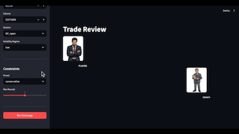

# Crucible — Player-Coach

**An adversarial quality loop for LLM-based trading decisions.**



[▶ Live dashboard](https://crucible-player-coach.streamlit.app) · [▶ Watch the demo](https://github.com/MaverickHQ/crucible-player-coach/releases/tag/v1.0.1) · [PyPI](https://pypi.org/project/player-coach-core/)

---

A PlayerAgent proposes trading actions; a CoachAgent evaluates every proposal mechanically against a formal constraint schema and rejects with a specific critique if any constraint is violated. The Player revises and resubmits for up to three rounds. The result is a structured artifact — every proposal, rejection, revision, and approval recorded, validated, and queryable.

---

## Installation

```bash
# Core infrastructure
pip install player-coach-core

# With LLM agents
pip install player-coach-core[llm]

# With Streamlit dashboard
pip install player-coach-core[dashboard]
```

Requires `ANTHROPIC_API_KEY` for LLM agents.

---

## Dashboard

A five-page Streamlit app for running and reviewing
player-coach exchanges.

Live demo: https://crucible-player-coach.streamlit.app

```bash
streamlit run dashboard/app.py
```

**Trade Review** — Run a live exchange. Player and Coach
characters animate with streaming speech bubbles. Round cards
show proposals, verdicts, violations, and critique.

**Constraints** — Configure the Coach's constraint schema.
Load presets, adjust sliders, export JSON, or push directly
to the Trade Review page.

**History** — Browse past exchanges from SQLite. Filter by
outcome. Select any row to inspect rounds and replay with
animation.

**Settings** — BYOK API key entry and validation. Key lives
in session memory only, never stored.

**Backtest** — Compare two constraint presets over historical
data side by side. Approval rate, average rounds, days aborted,
total return, and max drawdown with winner highlighted per metric.

---

## API key and database

**API key:** The dashboard uses a bring-your-own-key
model. Enter your Anthropic API key in the Settings
page. The key is stored in session memory only — it is
never written to disk, logged, or shared between users.
Each browser session is fully isolated.

**Database:** All exchanges are written to a shared
SQLite database on the Streamlit Cloud instance. The
History page shows exchanges from all users of the
live demo. For private use, run the dashboard locally:

```bash
git clone https://github.com/MaverickHQ/crucible-player-coach
pip install player-coach-core[dashboard]
streamlit run dashboard/app.py
```

---

## Constraint schema

```json
{
  "max_position_pct": 0.15,
  "max_single_trade_pct": 0.05,
  "max_leverage": 1.5,
  "max_drawdown_pct": 0.10,
  "max_daily_loss_pct": 0.02,
  "consistency_rule_pct": 0.50,
  "trading_cutoff_time": "16:20",
  "allowed_symbols": ["AMZN", "MSFT", "TSLA", "BTC-USD"],
  "max_open_positions": 3,
  "min_risk_reward": 1.5,
  "max_rounds": 3,
  "abort_on_violations": ["max_leverage", "max_drawdown_pct"]
}
```

Five presets in `examples/constraints/`:
`conservative`, `moderate`, `aggressive`,
`strict`, `futures_compatible`.

---

## Running locally

```python
from player_coach.agents.player import PlayerAgent
from player_coach.agents.coach import CoachAgent
from player_coach.artifacts.writer import ArtifactWriter
from player_coach.constraints.schema import ConstraintSchema
from player_coach.loop.coach_loop import CoachLoop
import json
from pathlib import Path

constraints = ConstraintSchema.from_dict(
    json.loads(Path("examples/constraints/moderate.json").read_text())
)

loop = CoachLoop(
    player=PlayerAgent(),
    coach=CoachAgent(),
    artifact_writer=ArtifactWriter("artifacts"),
)

artifact = loop.run(
    world_state={
        "symbol": "AMZN", "price": 185.0,
        "sma5": 183.0, "sma10": 180.0,
        "volume": 45_000_000, "position": "flat",
        "volatility_regime": "medium", "session": "NY_open",
    },
    constraints=constraints,
)

print(f"Outcome: {artifact['outcome']}")
print(f"Rounds:  {artifact['rounds_taken']}")
```

---

## Essays

Each essay is paired with a working implementation.

| # | Title | Link |
|---|---|---|
| 8 | The Adversarial Quality Loop | [Read →](https://harveygill.substack.com/p/the-adversarial-quality-loop) |
| 9 | Building the Player-Coach Loop | [Read →](https://harveygill.substack.com/p/building-the-player-coach-loop) |
| 10 | Closing the Evidence Loop | Coming soon |
| 11 | The Quality of Reasoning | Coming soon |

Part of the [Executable World Models](https://harveygill.substack.com) series on harveygill.substack.com.

---

## Demo


[▶ Full demo video](https://github.com/MaverickHQ/crucible-player-coach/releases/tag/v1.0.1)

---

## Architecture

| Component | Role |
|---|---|
| `PlayerAgent` | Proposes 1–3 actions given world state. Claude Haiku, max_tokens=1024. |
| `CoachAgent` | Evaluates proposals against constraint schema. max_tokens=1024. |
| `CoachLoop` | Orchestrates exchange. Up to 3 rounds. Writes artifact to disk and SQLite. |
| `circuit_breakers` | MLL, daily loss limit, consistency rule, trading cutoff — pure functions. |
| `ConstraintDeriver` | Derives constraint schema from ewm-core evidence policy. |
| `BacktestRunner` | Replays CoachLoop over historical trading days via yfinance. |
| `DatabaseStore` | SQLite persistence for exchanges, rounds, strategies, portfolio snapshots. |

---

## Circuit breakers

Four hard stops checked before every round, in priority order:

1. **MLL breached** — peak drawdown exceeded, account terminated
2. **Daily loss limit** — today's loss too large, skip today
3. **Consistency rule** — today's gain exceeds fraction of cumulative, skip today
4. **Trading cutoff** — market hours ended, skip today

---

## Related

| Repo | What |
|---|---|
| [crucible-ewm](https://github.com/MaverickHQ/crucible-ewm) | Observable agent trajectories, evidence policy, ewm-core |
| [beyond-tokens](https://github.com/MaverickHQ/beyond-tokens) | Constrained LLM planning on AWS Bedrock |

---

## Project status

**v1.1.0 — complete.** Backend, dashboard, tests, and PyPI
package all shipped.

Backlog: AWS AgentCore deployment — PlayerAgent and
CoachAgent as separate Lambda functions, Step Functions
orchestration, artifacts to S3.
